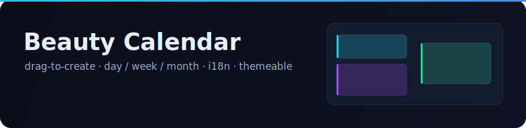

<div align="center">

# Beauty Calendar

**一个科技风、可拖拽创建日程的 Vue 3 日历组件。**

日 / 周 / 月视图 · 跨天拖拽创建 · 移动与缩放 · 右键删除 · 国际化 · 运行时换肤。

[](https://vuejs.org/)
[](https://www.typescriptlang.org/)
[](./LICENSE)
[](#参与贡献)

[English](./README.md) · **简体中文** · [繁體中文](./README.zh-TW.md) · [日本語](./README.ja.md)




</div>

---

## 为什么

大多数日历库要么笨重且高度耦合业务,要么只停留在静态渲染。Beauty Calendar 专注于两件真正难做好的事——**面板渲染**与**拖拽交互**——并且与任何后端完全解耦。数据模型刻意做得极小(`startTime`、`endTime`、`title`、`creator`),其余字段都交给你自由扩展。

## 目录

- [特性](#特性)
- [环境要求](#环境要求)
- [安装](#安装)
- [快速开始](#快速开始)
- [本地运行](#本地运行)
- [接入指南](#接入指南)
- [交互说明](#交互说明)
- [API 属性](#api-属性)
- [API 事件](#api-事件)
- [数据模型](#数据模型)
- [主题定制](#主题定制)
- [国际化](#国际化)
- [无头与进阶用法](#无头与进阶用法)
- [项目结构](#项目结构)
- [脚本命令](#脚本命令)
- [参与贡献](#参与贡献)
- [许可证](#许可证)

## 特性

- 🗓 **日 / 周 / 月**视图,带动画切换器
- 🖱 **拖拽创建**——日内纵向拖拽、**跨列拖拽生成跨天日程**(日 / 周视图),或在月视图跨格拖拽
- ✅ **二次确认弹窗**——拖拽后弹出浮层卡片(标题 · 时间 · 创建人),确认后才真正写入
- ↕ **移动与缩放**已有日程,带网格吸附(周视图还支持横向换天)
- 🗑 **右键菜单**删除日程
- 🧲 智能重叠布局——日 / 周视图按车道排布,月视图为跨天长条
- 🎨 **科技 / 赛博风主题**:6 套强调色预设 + 暗 / 亮配色,或自定义颜色——全部基于 CSS 变量
- 🌍 内置**国际化**(zh-CN / zh-TW / en / ja),可完全覆盖,零额外依赖
- 🧩 既可直接当组件用,也可使用无头核心函数(`createGeometry`、`layoutDay`、`layoutMonthWeek` 等)
- 📦 零业务耦合。Peer 依赖仅 `vue`、`dayjs`、`@vueuse/core`。产物含 ESM + UMD + 类型声明。

## 环境要求

- **Node** ≥ 18
- **Vue** ≥ 3.4(使用了 `defineModel`)
- 支持 `.vue` 单文件组件与 CSS 引入的构建工具(Vite、Vue CLI、Nuxt 等)

## 安装

```bash
pnpm add beauty-calendar
# 或
npm i beauty-calendar
# 或
yarn add beauty-calendar
```

`dayjs` 与 `@vueuse/core` 是运行时依赖;`vue` 是你已具备的 peer 依赖。

## 快速开始

```vue
<script setup lang="ts">
import { ref } from "vue";
import { BeautyCalendar, type CalendarEvent } from "beauty-calendar";
import "beauty-calendar/style.css";

const events = ref<CalendarEvent[]>([
  {
    id: "1",
    title: "设计评审",
    startTime: Date.now(),
    endTime: Date.now() + 60 * 60 * 1000,
    creator: "Alice",
  },
]);
</script>

<template>
  <div style="height: 100vh">
    <BeautyCalendar v-model:events="events" theme="aurora" scheme="dark" current-user="You" />
  </div>
</template>
```

> 组件会撑满父容器——记得给外层容器一个高度。

这就是全部配置。在空白网格上拖拽即可创建,拖拽日程可移动 / 缩放,右键可删除。创建 / 更新 / 删除会同时写回绑定的 `events` 模型**并**对外发出事件,因此开箱即用,又始终可控。

## 本地运行

克隆仓库并启动自带的 **playground**(Vite + Pinia)——探索每个属性与交互的最快方式:

```bash
git clone https://github.com/codeingforcoffee/beauty-calendar.git
cd beauty-calendar
pnpm install
pnpm play          # → http://localhost:5180
```

playground 用 **Pinia store** 保存演示数据,并提供主题、配色、语言、每周起始、行高、可编辑 / 可创建等开关,以及一条记录所有事件的活动日志。

构建库或 playground:

```bash
pnpm build         # 库 → dist/(ESM + UMD + .d.ts + css)
pnpm build:play    # 静态 playground → dist-play/
pnpm type-check    # vue-tsc 类型检查,不产出
pnpm test          # vitest 单元测试
```

## 接入指南

### 1. 局部组件(推荐)

```ts
import { BeautyCalendar } from "beauty-calendar";
import "beauty-calendar/style.css";
```

### 2. 全局插件

```ts
import { createApp } from "vue";
import { BeautyCalendarPlugin } from "beauty-calendar";
import "beauty-calendar/style.css";

createApp(App).use(BeautyCalendarPlugin).mount("#app");
// 此后任意位置都可使用 <BeautyCalendar />
```

### 3. 受控与非受控

所有状态都是 `v-model`——需要控制的就绑定,不需要的就省略:

```vue
<BeautyCalendar
  v-model:events="events"
  v-model:view="view"        <!-- 'day' | 'week' | 'month' -->
  v-model:date="anchorDate"  <!-- 可视范围锚点 -->
  v-model:locale="locale"
/>
```

### 4. 对接后端

组件会即时修改本地 `events` 模型以获得流畅反馈,同时发出同样的变更供你持久化。把事件当作同步点即可:

```vue
<script setup lang="ts">
import { ref } from "vue";
import { BeautyCalendar, type CalendarEvent, type TimeRange } from "beauty-calendar";
import { api } from "./api";

const events = ref<CalendarEvent[]>(await api.list());

const onCreate = (ev: CalendarEvent) => api.create(ev);
const onUpdate = (p: { id: string } & TimeRange) => api.patch(p.id, p);
const onDelete = (ev: CalendarEvent) => api.remove(ev.id);
</script>

<template>
  <BeautyCalendar
    v-model:events="events"
    @event-create="onCreate"
    @event-update="onUpdate"
    @event-delete="onDelete"
  />
</template>
```

想要自定义创建流程(比如弹出你自己的表单)?设置 `:confirm-create="false"` 并监听 `@event-create`,或保留内置确认弹窗、在那里读取标题。

## 交互说明

| 手势                         | 结果                                                |
| ---------------------------- | --------------------------------------------------- |
| 在空白网格拖拽(日 / 周)    | 创建——单天纵向拖拽,**跨列拖拽生成跨天日程**        |
| 点击空白网格(日 / 周)      | 在该时刻创建一个 `defaultCreateMinutes` 时长的日程  |
| 在月视图跨格拖拽             | 创建跨这些天的日程(开始 = 最近的步进时间)         |
| 拖拽日程主体                 | 移动(周视图同时换天)                              |
| 拖拽日程上 / 下边缘          | 缩放(仅单天日程)                                  |
| 右键日程                     | 打开菜单 → **删除**                                 |
| 点击日期数字 / 表头          | 跳转到该天的「日」视图                              |

拖拽创建默认弹出**确认弹窗**;按 <kbd>Enter</kbd> 确认,<kbd>Esc</kbd> 或点击外部取消。

## API 属性

| 属性                   | 类型                                       | 默认值     | 说明                                |
| ---------------------- | ------------------------------------------ | ---------- | ----------------------------------- |
| `v-model:events`       | `CalendarEvent[]`                          | `[]`       | 要渲染的日程(双向)。              |
| `v-model:view`         | `'day' \| 'week' \| 'month'`               | `'week'`   | 当前视图。                          |
| `v-model:date`         | `number \| string \| Date`                 | 当前时间   | 可视范围的锚点日期。                |
| `v-model:locale`       | `string`                                   | `'zh-CN'`  | 语言 key。                          |
| `theme`                | `string \| { accent, accent2 }`            | `'aurora'` | 强调色预设 key 或显式颜色对。       |
| `scheme`               | `'dark' \| 'light'`                        | `'dark'`   | 配色方案。                          |
| `weekStart`            | `0 \| 1`                                    | `1`        | 每周起始为周日(0)或周一(1)。   |
| `hourHeight`           | `number`                                    | `56`       | 每小时行高(像素)。               |
| `snapMinutes`          | `number`                                    | `15`       | 拖拽吸附粒度(分钟)。             |
| `minEventMinutes`      | `number`                                    | `15`       | 渲染的最小时长。                    |
| `defaultCreateMinutes` | `number`                                    | `30`       | 未拖动直接点击创建时的时长。        |
| `editable`             | `boolean`                                   | `true`     | 允许移动 / 缩放。                   |
| `creatable`            | `boolean`                                   | `true`     | 允许拖拽创建。                      |
| `deletable`            | `boolean`                                   | `true`     | 允许右键删除。                      |
| `confirmCreate`        | `boolean`                                   | `true`     | 拖拽创建后是否弹出确认弹窗。        |
| `currentUser`          | `string`                                    | —          | 写入新建日程的创建人标识。          |
| `messages`             | `Record<string, Partial<LocaleMessages>>`   | —          | 按语言覆盖文案。                    |
| `nowInterval`          | `number`                                    | `30000`    | 当前时间指示线的刷新间隔(毫秒)。 |

## API 事件

| 事件           | 载荷                          | 触发时机                            |
| -------------- | ----------------------------- | ----------------------------------- |
| `event-create` | `CalendarEvent`               | 拖拽 / 点击创建被确认后。           |
| `event-update` | `{ id, startTime, endTime }`  | 移动 / 缩放结束后。                 |
| `event-delete` | `CalendarEvent`               | 从菜单删除日程后。                  |
| `event-click`  | `CalendarEvent`               | 点击(非拖拽)日程时。              |
| `date-click`   | `Dayjs`                       | 点击日期数字 / 表头时。            |

## 数据模型

```ts
interface CalendarEvent {
  id: string;        // 稳定 id,用于 key 及更新 / 删除
  title: string;
  startTime: number; // epoch 毫秒
  endTime: number;   // epoch 毫秒
  creator?: string;  // 可选标识;同时作为自动配色的种子
  color?: string;    // 可选显式颜色;否则按 creator 推导
  [key: string]: unknown; // 自由携带你自己的字段
}
```

## 主题定制

一套主题就是两个强调色;中性色板来自配色方案。可用预设 key 或自定义颜色对:

```vue
<BeautyCalendar theme="neon" scheme="dark" />
<BeautyCalendar :theme="{ accent: '#22d3ee', accent2: '#6366f1' }" scheme="light" />
```

预设:`aurora` · `neon` · `matrix` · `sunset` · `ice` · `gold`。

每个视觉值都是作用于 `.beauty-calendar` 的 CSS 变量,你可以在自己的样式里覆盖任意一项:

```css
.beauty-calendar {
  --bc-hour-height: 64px;
  --bc-radius-md: 14px;
  --bc-now: #ff3366;
}
```

## 国际化

内置语言:`zh-CN`、`zh-TW`、`en`、`ja`。可按语言覆盖文案,或新增你自己的语言:

```vue
<BeautyCalendar
  locale="en"
  :messages="{ en: { createNew: 'Add', views: { week: 'Wk' } } }"
/>
```

日期格式由语言包中的 `monthsLong` / `weekdaysLong` 数组驱动(无需 dayjs 的 locale 包),因此覆盖文案也会同步本地化表头。要注册一种全新语言,在 `messages` 中以新 key 传入完整的 `LocaleMessages`,再把 `locale` 指向它即可。

## 无头与进阶用法

几何与布局计算都已导出,可用于自定义渲染器:

```ts
import {
  createGeometry, // 像素 ↔ 时间换算与吸附
  layoutDay,      // 单天列的重叠车道
  layoutMonthWeek,// 月视图某周行的跨天长条
  viewDays,       // 日 / 周 / 月网格生成
  nearestStepMinutes,
} from "beauty-calendar";

const geo = createGeometry(56, 15);
const positioned = layoutDay(Date.now(), events, geo); // → { top, height, lane, lanes, … }[]
```

也可以在子组件中 `useCalendar()` 读取实时上下文(视图、几何、文案、动作),拼装你自己的部件。

## 项目结构

```
src/
  core/         # 纯逻辑(无 Vue):time、layout、month-layout、grid、format
  composables/  # use-context(provide/inject)、use-drag-create、use-drag-move
  components/   # BeautyCalendar、表头、视图(日周 / 月)、日程块、弹窗、菜单
  i18n/         # 语言注册表 + zh-CN / zh-TW / en / ja
  theme/        # 强调色预设 + 自动配色板
  styles/       # 设计令牌(CSS 变量)+ 基础样式
  index.ts      # 对外入口
playground/     # Vite + Pinia 演示应用
```

## 脚本命令

| 命令               | 说明                       |
| ------------------ | -------------------------- |
| `pnpm play`        | 启动 playground 开发服务器 |
| `pnpm dev`         | `pnpm play` 的别名         |
| `pnpm build`       | 将库构建到 `dist/`         |
| `pnpm build:play`  | 构建静态 playground        |
| `pnpm type-check`  | 用 `vue-tsc` 做类型检查    |
| `pnpm test`        | 用 Vitest 运行单元测试     |

## 参与贡献

欢迎 issue 与 PR。开始开发:

```bash
pnpm install
pnpm play          # 基于 playground 开发
pnpm type-check    # 保持类型干净
```

约定:全程 TypeScript;保持 `src/core/**` 不依赖 Vue / DOM 以便单测;遵循既有组件风格。提交 PR 前请先跑 `pnpm type-check`。

## 许可证

[MIT](./LICENSE) © coffeefish
